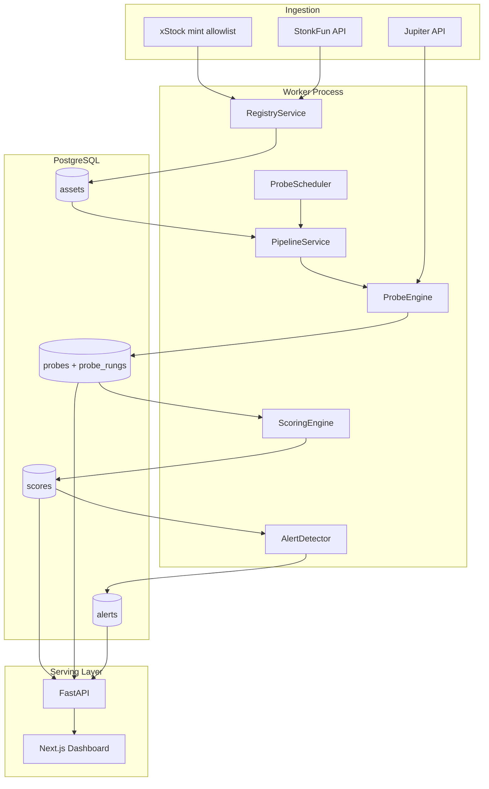

# Synthetic Liquidity Depth Scanner — How It Works

This document explains the system workflow, runtime architecture, and core code logic for the Liquidity Depth Scanner. It is intended for engineers onboarding to the project or reviewing the implementation against the engineering plan.

---

## 1. Purpose

The scanner answers one question for Solana tokenized equities and stock-quoted launches:

> **"If I hold $X of this asset, how much USDC can I actually get out, and what breaks first?"**

It does **not** rely on pool TVL or printed market cap alone. Instead, it probes live Jupiter swap quotes at escalating order sizes and builds an **executable cash-exit curve** for each asset.

### What the measurement phase established

These design choices are baked into the code:

| Finding | Implementation consequence |
|--------|-----------------------------|
| TVL/mcap ratio is a weak predictor of exit cost | Primary score is **exit capacity** and **mcap-to-exit ratio**, not TVL ratio |
| Hidden leg-2 tax on stock-quoted launches is usually &lt;1% | Two-hop cost is a **diagnostic** (`binding_leg`), not the headline metric |
| Routing cliffs and no-route walls are invisible in TVL | **Cliff detection** and **no-route ceiling** are first-class outputs |
| Ticker impersonation is common | **Mint-keyed registry** with impersonation flags is a prerequisite |
| Decimals and baseline methodology matter | Decimals come from Jupiter `price/v3`; impact is measured vs a **micro-quote baseline** |

---

## 2. System overview

The service is a hosted pipeline with four runtime processes:

```
┌─────────────┐     ┌──────────────┐     ┌─────────────┐
│   Worker    │────▶│  PostgreSQL  │◀────│     API     │
│ (scheduler) │     │  (Timescale) │     │  (FastAPI)  │
└──────┬──────┘     └──────────────┘     └──────┬──────┘
       │                                         │
       ▼                                         ▼
┌─────────────┐                          ┌─────────────┐
│   Jupiter   │                          │  Dashboard  │
│  Swap/Price │                          │  (Next.js)  │
└─────────────┘                          └─────────────┘
```

| Component | Entry point | Role |
|-----------|-------------|------|
| **Worker** | `python -m liquidity_scanner.worker` | Discovers assets, schedules probes, writes scores and alerts |
| **API** | `uvicorn liquidity_scanner.api.main:app` | Serves asset data, exit curves, leaderboard, alerts |
| **Dashboard** | `dashboard/` (Next.js) | Visualizes leaderboard, asset detail, position calculator |
| **Database** | Postgres 16 + TimescaleDB | Stores assets, probes, rungs, scores, alerts |

External data sources:

- **StonkFun API** — xStock quote pairs and graduated stock-quoted launches
- **Jupiter API** — live swap quotes (`/swap/v1/quote`) and token prices (`/price/v3`)
- **Issuer mint list** — hardcoded xStock mints in `constants.py` (from pump.fun / xStocks published lists)

---

## 3. End-to-end workflow

### 3.1 Bootstrap

1. Copy `.env.example` → `.env` and set `JUP_API_KEY` (paid Jupiter tier recommended; free tier is rate-limited).
2. Start Postgres: `docker compose up -d db`
3. Run migrations: `alembic upgrade head`
4. Start API and worker (or `docker compose up`)

### 3.2 Registry sync (every 6 hours)

```
StonkFun /pairs + /tokens
        │
        ▼
RegistrySources.build_snapshot()
        │
        ▼
ImpersonationDetector.detect()
        │
        ▼
RegistryService.sync() ──▶ assets + impersonation_flags tables
        │
        ▼
ProbeScheduler._assign_tiers() ──▶ tier A / B / C per asset
```

**What gets registered:**

- **24 xStock quote assets** — issuer-verified mints from `constants.XSTOCK_MINTS`
- **~395 graduated launches** — tokens paired against xStocks, discovered via StonkFun paginated `/tokens?status=graduated&quoteMint=...`

Every asset is keyed by **mint address**, never by ticker symbol.

### 3.3 Scheduled probing (tiered cadence)

| Tier | Assets | Cadence | Typical contents |
|------|--------|---------|------------------|
| **A** | xStocks + top 50 launches | Every 15 min | Highest-signal universe |
| **B** | Next 150 launches | Hourly | Mid-priority |
| **C** | Remaining launches | Every 6 hours | Long tail |

Before each tier run, the scheduler checks the **monthly Jupiter credit budget** (`MONTHLY_CREDIT_BUDGET`). If the budget would be exceeded, the run is skipped.

### 3.4 Per-asset probe cycle

For each asset in the tier batch:

```
Asset (from DB)
    │
    ▼
ProbeEngine.probe_asset()
    │  ├─ Fetch price + decimals (Jupiter price/v3)
    │  ├─ Micro baseline quote ($200 → USDC)
    │  ├─ Ladder quotes ($1k … $1M → USDC)
    │  ├─ For launches: leg1 (token→quote stock) + leg2 (quote→USDC)
    │  └─ Cliff bisection when route/efficiency discontinuity detected
    │
    ▼
PipelineService.probe_assets()
    │  ├─ Write probes + probe_rungs
    │  ├─ ScoringEngine.score()
    │  ├─ Write scores
    │  └─ AlertDetector.compare() → alerts + notifier
    │
    ▼
PostgreSQL
```

### 3.5 Consumption

- **API** reads latest scores and probe rungs from the database.
- **Dashboard** calls API endpoints for leaderboard, asset detail, and exit calculator.
- **Alerts** are emitted when exit capacity degrades, cliffs appear, or no-route ceilings tighten.

---

## 4. Code layout

```
src/liquidity_scanner/
├── config.py              # Settings (env vars, Jupiter URLs, ladder sizes)
├── constants.py           # Verified xStock mint allowlist
├── worker.py              # Scheduler process entry point
├── pipeline.py            # Orchestrates probe → score → alert per asset
│
├── registry/
│   ├── sources.py         # StonkFun discovery (pairs + paginated tokens)
│   ├── impersonation.py   # Fake-token detection
│   └── service.py         # DB upsert for assets and flags
│
├── probe/
│   ├── jupiter.py         # Jupiter HTTP client (quotes, prices)
│   ├── rate_limit.py      # Token-bucket limiter + Retry-After handling
│   └── engine.py          # Ladder probing, baseline, cliff bisection
│
├── scoring/
│   └── engine.py          # Pure scoring from rung data (no I/O)
│
├── scheduler/
│   ├── scheduler.py       # APScheduler jobs, tier assignment, credit guard
│   └── session_state.py   # US market session tagging (regular/extended/weekend)
│
├── alerting/
│   ├── detector.py        # Compare previous vs current score
│   └── notifier.py        # Log + optional webhook delivery
│
├── db/
│   ├── models.py          # SQLAlchemy ORM models
│   └── session.py         # Async engine + session factory
│
├── api/
│   └── main.py            # FastAPI routes
│
└── schemas.py             # Pydantic response models

dashboard/                   # Next.js frontend
tests/                       # Unit tests + regression fixtures
alembic/                     # Database migrations
```

---

## 5. Core logic

### 5.1 Registry (`registry/`)

**Discovery** (`RegistrySources`):

1. Fetch all launchable pairs from StonkFun.
2. Filter `category == "xstock"`.
3. Seed the registry with verified xStock mints from `XSTOCK_MINTS`.
4. For each xStock quote mint, paginate graduated launch tokens and add them as `kind="launch"`.

**Impersonation detection** (`ImpersonationDetector`):

| Rule | Reason code | Example |
|------|-------------|---------|
| Same symbol as verified mint, different address | `symbol_collision` | Fake `HOODx` token |
| Verified mint embedded in token name | `name_field_mint_stuffing` | Name contains real mint to defeat string search |
| Unverified `pump` suffix | `unverified_pump_suffix` | Counterfeit pump.fun clone |

Flagged tokens are stored in `impersonation_flags` but are not automatically excluded from probing in v1.

### 5.2 Probe engine (`probe/engine.py`)

The probe engine is the measurement core. For each asset it produces a **depth curve**: cash received (USDC) at multiple notionally-sized exit attempts.

#### Step 1 — Reference price and decimals

```python
prices = await jup.get_prices([asset.mint])
decimals = meta.decimals          # Always from API, never assumed
ref_price = meta.usd_price
```

Using API-sourced decimals prevents the methodology bug where assumed 6-decimal formatting produced flat, wrong slippage curves.

#### Step 2 — Micro-quote baseline ($200)

A small sell quote establishes the **execution price baseline**:

```python
base_qty = 200 / ref_price
baseline_exec_px = base_out_usd / base_qty
```

All ladder rungs measure **relative impact** against this baseline, not against the external oracle price. This separates:

- **Size-dependent slippage** (what we want)
- **Premium/discount to oracle** (orthogonal signal)

#### Step 3 — Sell ladder

Default notionals (configurable in `config.py`):

```
$1k → $10k → $50k → $100k → $250k → $500k → $1M
```

For each rung:

1. Compute token quantity: `qty = notional / ref_price`
2. Request Jupiter quote: `token → USDC`
3. Take the **median of 3 samples** to reduce quote noise
4. Record: `out_usd`, `efficiency`, `route_labels`, `rfq_share`, `no_route`

#### Step 4 — Launch-specific diagnostics

For `kind == "launch"` with a quote stock (e.g. STONK/SPYx):

- **Leg 1**: `token → quote_stock` (what the pool page shows)
- **Leg 2**: `quote_stock → USDC` (cash conversion)
- **Binding leg**: which leg constrains the exit (`leg1`, `leg2`, `balanced`, `no_route`)

Measurement showed leg-2 is rarely the binding constraint when quote stocks are liquid; leg-1 (the launch pool) usually dominates.

#### Step 5 — Cliff detection and bisection

When adjacent ladder rungs show:

- Efficiency drop &gt; `cliff_efficiency_delta` (default 15%), **and**
- Route composition changes

…the engine runs **bisection** between the two notionals to refine the cliff boundary. This catches cases like STRCx, where execution collapses between $150k and $200k due to a router path change.

#### Rate limiting

`TokenBucketRateLimiter` enforces `JUP_RPS` (default 10 req/s). On HTTP 429, it reads `Retry-After` and backs off before retrying.

### 5.3 Scoring engine (`scoring/engine.py`)

Scoring is a **pure function** over probe rungs — no network I/O. This allows re-scoring stored data without re-probing.

**Inputs:** list of rungs + optional mcap + cliff delta threshold

**Outputs:**

| Field | Meaning |
|-------|---------|
| `exit_capacity_99/95/90` | Largest notional where cash efficiency ≥ 99% / 95% / 90% (log-linear interpolation between rungs) |
| `no_route_ceiling` | Smallest notional where Jupiter returns no route |
| `mcap_exit_ratio` | `mcap_usd / exit_capacity_95` — headline risk metric |
| `binding_leg` | Dominant constraint for launches |
| `cliff_detected` | Route-change discontinuity found |
| `cliff_notional` | Notional where cliff begins |
| `rfq_dependence` | Average share of RFQ venues in routes (Riptide, Byreal, etc.) |
| `grade` | Letter grade A–F based on capacity, cliffs, and mcap ratio |

**Grading logic (simplified):**

- **A**: exit capacity @95% ≥ $250k
- **B**: ≥ $50k
- **C**: ≥ $10k
- **D**: thin liquidity, early no-route, or cliff detected
- **F**: mcap/exit ratio &gt; 1000 (printed valuation far exceeds executable exit)

### 5.4 Pipeline (`pipeline.py`)

`PipelineService.probe_assets()` is the glue between probe, storage, scoring, and alerting:

```python
for asset in assets:
    result = await probe_engine.probe_asset(asset)
    # 1. Persist Probe + ProbeRung rows
    # 2. Score the rungs
    # 3. Persist Score row
    # 4. Compare to previous score → emit Alert rows
    # 5. Notify via AlertNotifier (log + optional webhook)
```

### 5.5 Scheduler (`scheduler/scheduler.py`)

Uses APScheduler with four jobs:

| Job | Interval | Action |
|-----|----------|--------|
| `registry_sync` | 6 hours | Refresh asset universe + reassign tiers |
| `tier_a` | 15 minutes | Probe tier A assets |
| `tier_b` | 1 hour | Probe tier B assets |
| `tier_c` | 6 hours | Probe tier C assets |

**Tier assignment:**

- All xStocks → tier A
- Launches ranked by symbol order: first 50 → A, next 150 → B, rest → C

**Credit budget guard:** estimated 8 Jupiter credits per asset per cycle. If monthly budget would be exceeded, the tier run is skipped.

### 5.6 Alerting (`alerting/`)

`AlertDetector` compares the new score to the previous score for the same mint:

| Alert kind | Trigger |
|------------|---------|
| `exit_capacity_degraded` | exit_capacity_95 drops ≥25% (≥50% → critical) |
| `new_cliff_detected` | cliff flag newly set |
| `no_route_ceiling_lowered` | hard capacity wall moved to smaller size |

`AlertNotifier` logs all alerts and optionally POSTs JSON to a webhook URL.

### 5.7 API (`api/main.py`)

| Endpoint | Purpose |
|----------|---------|
| `GET /health` | Service health check |
| `GET /assets` | List assets with latest score |
| `GET /assets/{mint}` | Asset detail + latest exit curve rungs |
| `GET /assets/{mint}/history` | Probe/score history |
| `GET /exit-quote?mint=&notional=` | Live exit quote for a specific position size |
| `GET /leaderboard?sort=` | Ranked by mcap_exit_ratio or exit_capacity_95 |
| `GET /alerts` | Recent degradation/cliff alerts |

`/exit-quote` runs a live probe (not cached) — useful for ad-hoc position sizing but expensive on Jupiter credits.

---

## 6. Database schema

```
assets
  mint (PK), symbol, name, kind, quote_mint, pool, tier, verified_source, ...

probes
  id (PK), mint (FK), probed_at, session_state, ref_price_usd, baseline_exec_px, ok, error

probe_rungs
  id (PK), probe_id (FK), notional_usd, out_usd, efficiency, route_labels,
  rfq_share, no_route, leg1_route, leg2_route, binding_leg

scores
  id (PK), mint (FK), computed_at, exit_capacity_99/95/90, no_route_ceiling,
  mcap_exit_ratio, binding_leg, cliff_detected, cliff_notional, rfq_dependence, grade

impersonation_flags
  id (PK), mint, suspected_target_mint, reason, confidence, detected_at

alerts
  id (PK), mint, kind, detected_at, prev_value, new_value, severity
```

**Design choice:** `probes` and `probe_rungs` are stored separately so the raw depth curve is queryable and re-scorable without re-probing.

---

## 7. Dashboard (`dashboard/`)

A Next.js app that consumes the API:

| Page | Route | Data source |
|------|-------|-------------|
| Leaderboard | `/` | `GET /leaderboard` |
| Asset detail | `/asset/[mint]` | `GET /assets/{mint}` — curve chart + route table |
| Calculator | `/calculator` | `GET /assets` + `GET /exit-quote` |

The exit curve chart plots **cash efficiency %** vs **notional USD** from the latest probe rungs.

---

## 8. Configuration

Key environment variables (see `.env.example`):

| Variable | Default | Purpose |
|----------|---------|---------|
| `DATABASE_URL` | `postgresql+asyncpg://...` | Async Postgres connection |
| `JUP_API_KEY` | (empty) | Jupiter API key; uses `api.jup.ag` when set, `lite-api.jup.ag` when empty |
| `JUP_RPS` | `10` | Rate limit for Jupiter requests |
| `MONTHLY_CREDIT_BUDGET` | `25000000` | Scheduler credit guard (Developer tier = 25M/month) |
| `ENABLE_SCHEDULER` | `true` | Worker scheduler on/off |
| `LOG_LEVEL` | `INFO` | Structlog level |

Probe ladder sizes and RFQ venue list are in `config.py` and can be adjusted without code changes to the engine logic.

---

## 9. Testing and validation

```
tests/
├── test_scoring.py          # Regression fixtures (SPYx, STONK, STRCx cliff, FTR no-route)
├── test_impersonation.py    # Mint-stuffing detection
├── test_session_state.py    # Weekend/regular session tagging
├── test_live_smoke.py       # Live Jupiter quote (skipped without JUP_API_KEY)
└── fixtures/
    └── regression_rungs.json
```

**Methodology guards** in tests:

- Reject flat-across-sizes curves with nonzero offset (external-price baseline bug)
- Assert cliff detection on STRCx fixture
- Assert no-route ceiling on FTR fixture

Run: `pytest -q`

---

## 10. Deployment

### Local (development)

```bash
docker compose up -d db
pip install -e ".[dev]"
alembic upgrade head
uvicorn liquidity_scanner.api.main:app --reload --app-dir src
python -m liquidity_scanner.worker
cd dashboard && npm install && npm run dev
```

### Docker Compose (full stack)

```bash
docker compose up
```

Services: `db` (5432), `api` (8000), `worker`, `dashboard` (3000).

### Manual registry sync

```bash
lds sync-registry
```

---

## 11. Data flow diagram



---

## 12. Research artifacts (pre-service)

The `measure_two_hop.py` script and JSON files in the repo root (`scan_results.json`, `two_hop_measurement.json`, `two_hop_verdict.json`) are **research outputs** from the feasibility phase. They informed the design but are not part of the production pipeline. The production probe engine in `src/liquidity_scanner/probe/` supersedes that script.

---

## 13. Known limitations (v1)

- **RFQ depth is quoted, not committed** — RFQ venues are tagged separately but may overstate safety under stress.
- **Mcap on launches** — market cap is not always available at score time; `mcap_exit_ratio` may be null for some launches.
- **No redemption channel modelling** — issuer primary redemption (Ondo, Backpack) is not encoded yet.
- **US session tagging is simplified** — no holiday calendar; weekend/regular/extended/overnight only.
- **Tier assignment** — launches are tiered by list order, not live mcap ranking (mcap not always in registry).

These are documented non-goals or deferred items from the engineering plan.
